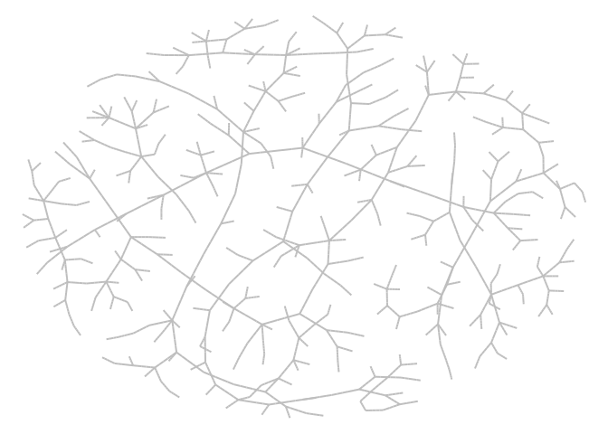

<!-- README.md is generated from README.Rmd. Please edit that file -->

## Versions

The virtual INSNA Sunbelt 2023 session can be found here:
<https://github.com/UofUEpiBio/epiworldR-workshop/tree/sunbelt2023-virtual>

The in-person INSNA Sunbelt 2023 session can be found here:
<https://github.com/UofUEpiBio/epiworldR-workshop/tree/sunbetl2023-inperson>

# epiworldR

<!-- badges: start -->

[](https://CRAN.R-project.org/package=epiworldR)
[](https://github.com/UofUEpiBio/epiworldR/actions/workflows/r.yml)
[](https://cran.r-project.org/package=epiworldR)
[](https://github.com/UofUEpiBio/epiworldR/blob/master/LICENSE.md)
<!-- badges: end -->

This R package is a wrapper of the C++ library
<a href="https://github.com/UofUEpiBio/epiworld"
target="_blank">epiworld</a>. It provides a general framework for
modeling disease transmission using <a
href="https://en.wikipedia.org/w/index.php?title=Agent-based_model&amp;oldid=1153634802"
target="_blank">agent-based models</a>. Some of the main features
include:

- Fast simulation with an average of 30 million agents/day per second.
- One model can include multiple diseases.
- Policies (tools) can be multiple and user-defined.
- Transmission can be a function of agents’ features.
- Out-of-the-box parallelization for multiple simulations.

From the package’s description:

> A flexible framework for Agent-Based Models (ABM), the epiworldR
> package provides methods for prototyping disease outbreaks and
> transmission models using a C++ backend, making it very fast. It
> supports multiple epidemiological models, including the
> Susceptible-Infected-Susceptible (SIS), Susceptible-Infected-Removed
> (SIR), Susceptible-Exposed-Infected-Removed (SEIR), and others,
> involving arbitrary mitigation policies and multiple-disease models.
> Users can specify infectiousness/susceptibility rates as a function of
> agents’ features, providing great complexity for the model dynamics.
> Furthermore, epiworldR is ideal for simulation studies featuring large
> populations.

## Installation

You can install the development version of epiworldR from
[GitHub](https://github.com/) with:

``` r
devtools::install_github("UofUEpiBio/epiworldR")
```

Or from CRAN

``` r
install.packages("epiworldR")
```

# Examples

This R package includes several popular epidemiological models including
<a
href="https://en.wikipedia.org/w/index.php?title=Compartmental_models_in_epidemiology&amp;oldid=1155757336#Variations_on_the_basic_SIR_model"
target="_blank">SIS</a>, <a
href="https://en.wikipedia.org/w/index.php?title=Compartmental_models_in_epidemiology&amp;oldid=1155757336#The_SIR_model"
target="_blank">SIR</a>, and <a
href="https://en.wikipedia.org/w/index.php?title=Compartmental_models_in_epidemiology&amp;oldid=1155757336#The_SEIR_model"
target="_blank">SEIR</a> using either a fully connected graph (similar
to a compartmental model) or a user-defined network. Here are some
examples:

## SIR model using a random graph

This Susceptible-Infected-Recovered model features a population of
100,000 agents simulated in a small-world network. Each agent is
connected to ten other agents. One percent of the population has the
virus, with a 70% chance of transmission. Infected individuals recover
at a 0.3 rate:

``` r
library(epiworldR)

# Creating a SIR model
sir <- ModelSIR(
  name              = "COVID-19",
  prevalence        = .01,
  transmission_rate = .7,
  recovery          = .3
  ) |>
  # Adding a Small world population 
  agents_smallworld(n = 100000, k = 10, d = FALSE, p = .01) |>
  # Running the model for 50 days
  run(ndays = 50, seed = 1912)
#> _________________________________________________________________________
#> |Running the model...
#> |||||||||||||||||||||||||||||||||||||||||||||||||||||||||||||||||||||||| done.
#> | done.

sir
#> ________________________________________________________________________________
#> Susceptible-Infected-Recovered (SIR)
#> It features 100000 agents, 1 virus(es), and 0 tool(s).
#> The model has 3 states.
#> The final distribution is: 822 Susceptible, 415 Infected, and 98763 Recovered.
```

Visualizing the outputs

``` r
summary(sir)
#> ________________________________________________________________________________
#> ________________________________________________________________________________
#> SIMULATION STUDY
#> 
#> Name of the model   : Susceptible-Infected-Recovered (SIR)
#> Population size     : 100000
#> Agents' data        : (none)
#> Number of entities  : 0
#> Days (duration)     : 50 (of 50)
#> Number of viruses   : 1
#> Last run elapsed t  : 456.00ms
#> Last run speed      : 10.94 million agents x day / second
#> Rewiring            : off
#> 
#> Global actions:
#>  (none)
#> 
#> Virus(es):
#>  - COVID-19 (baseline prevalence: 1.00%)
#> 
#> Tool(s):
#>  (none)
#> 
#> Model parameters:
#>  - Recovery rate     : 0.3000
#>  - Transmission rate : 0.7000
#> 
#> Distribution of the population at time 50:
#>   - (0) Susceptible :  99000 -> 822
#>   - (1) Infected    :   1000 -> 415
#>   - (2) Recovered   :      0 -> 98763
#> 
#> Transition Probabilities:
#>  - Susceptible  0.91  0.09  0.00
#>  - Infected     0.00  0.70  0.30
#>  - Recovered    0.00  0.00  1.00
plot(sir)
```


## SEIR model with a fully connected graph

The SEIR model is similar to the SIR model but includes an exposed
state. Here, we simulate a population of 10,000 agents with a 0.01
prevalence, a 0.6 transmission rate, a 0.5 recovery rate, and 7
days-incubation period. The population is fully connected, meaning
agents can transmit the disease to any other agent:

``` r
model_seirconn <- ModelSEIRCONN(
  name                = "COVID-19",
  prevalence          = 0.01, 
  n                   = 10000,
  contact_rate        = 4, 
  incubation_days     = 7, 
  transmission_rate   = 0.6,
  recovery_rate       = 0.5
) |> add_virus(virus("COVID-19", 0.01, 0.6, 0.5, 7), .5)

set.seed(132)
run(model_seirconn, ndays = 100)
#> _________________________________________________________________________
#> Running the model...
#> ||||||||||||||||||||||||||||||||||||||||||||||||||||||||||||||||||||||||| done.
#>  done.
model_seirconn
#> ________________________________________________________________________________
#> Susceptible-Exposed-Infected-Removed (SEIR) (connected)
#> It features 10000 agents, 2 virus(es), and 0 tool(s).
#> The model has 4 states.
#> The final distribution is: 608 Susceptible, 4 Exposed, 2 Infected, and 9386 Recovered.
```

Computing some key statistics

``` r
plot(model_seirconn)
```


``` r

repnum <- get_reproductive_number(model_seirconn)

head(plot(repnum))
```


    #>   virus_id    virus date      avg  n       sd lb    ub
    #> 1        0 COVID-19    0 2.858974 78 2.592318  1  7.30
    #> 2        0 COVID-19    2 1.964286 28 1.914509  0  5.65
    #> 3        0 COVID-19    3 2.761905 21 2.321740  0  7.00
    #> 4        0 COVID-19    4 2.000000 33 1.887459  0  6.40
    #> 5        0 COVID-19    5 1.864865 37 2.225636  0  9.10
    #> 6        0 COVID-19    6 2.104167 48 2.667692  0 10.65

    plot_incidence(model_seirconn)


``` r
head(plot_generation_time(model_seirconn))
```


    #>   date      avg  n       sd ci_lower ci_upper    virus virus_id
    #> 1    2 5.714286 21 4.681270        2    17.00 COVID-19        0
    #> 2    3 7.444444 18 4.501271        2    15.45 COVID-19        0
    #> 3    4 7.192308 26 5.578668        2    20.75 COVID-19        0
    #> 4    5 7.111111 27 4.236593        2    15.70 COVID-19        0
    #> 5    6 7.575000 40 7.249713        2    30.20 COVID-19        0
    #> 6    7 6.303030 33 4.531038        2    18.00 COVID-19        0

## SIR Logit

This model provides a more complex transmission and recovery pattern
based on agents’ features. With it, we can reflect co-morbidities that
could change the probability of infection and recovery. Here, we
simulate a population including a dataset with two features: an
intercept and a binary variable `Female`. The probability of infection
and recovery are functions of the intercept and the `Female` variables.
The following code simulates a population of 100,000 agents in a
small-world network. Each agent is connected to eight other agents. One
percent of the population has the virus, with an 80% chance of
transmission. Infected individuals recover at a 0.3 rate:

``` r
# Simulating a population of 100,000 agents
set.seed(2223)
n <- 100000

# Agents' features
X <- cbind(
  Intercept = 1,
  Female    = sample.int(2, n, replace = TRUE) - 1
  )

coef_infect  <- c(.1, -2, 2)
coef_recover <- rnorm(2)

# Creating the model
model_logit <- ModelSIRLogit(
  "covid2",
  data = X,
  coefs_infect      = coef_infect,
  coefs_recover     = coef_recover, 
  coef_infect_cols  = 1L:ncol(X),
  coef_recover_cols = 1L:ncol(X),
  prob_infection = .8,
  recovery_rate = .3,
  prevalence = .01
)

# Adding a small-world population
agents_smallworld(model_logit, n, 8, FALSE, .01)

# Running the model
run(model_logit, 50)
#> _________________________________________________________________________
#> |Running the model...
#> |||||||||||||||||||||||||||||||||||||||||||||||||||||||||||||||||||||||| done.
#> | done.
plot(model_logit)
```


``` r

# Females are supposed to be more likely to become infected
rn <- get_reproductive_number(model_logit)

(table(
  X[, "Female"],
  (1:n %in% rn$source)
) |> prop.table())[,2]
#>       0       1 
#> 0.12984 0.14201

# Looking into the agents
get_agents(model_logit)
#> Agents from the model "Susceptible-Infected-Removed (SIR) (logit)":
#> Agent: 0, state: Recovered (2), Has virus: no, NTools: 0, NNeigh: 8
#> Agent: 1, state: Recovered (2), Has virus: no, NTools: 0, NNeigh: 8
#> Agent: 2, state: Recovered (2), Has virus: no, NTools: 0, NNeigh: 8
#> Agent: 3, state: Recovered (2), Has virus: no, NTools: 0, NNeigh: 8
#> Agent: 4, state: Recovered (2), Has virus: no, NTools: 0, NNeigh: 8
#> Agent: 5, state: Recovered (2), Has virus: no, NTools: 0, NNeigh: 8
#> Agent: 6, state: Recovered (2), Has virus: no, NTools: 0, NNeigh: 8
#> Agent: 7, state: Recovered (2), Has virus: no, NTools: 0, NNeigh: 8
#> Agent: 8, state: Susceptible (0), Has virus: no, NTools: 0, NNeigh: 8
#> Agent: 9, state: Recovered (2), Has virus: no, NTools: 0, NNeigh: 8
#> ... 99990 more agents ...
```

## Transmission network

This example shows how we can draw a transmission network from a
simulation. The following code simulates a population of 500 agents in a
small-world network. Each agent is connected to ten other agents. One
percent of the population has the virus, with a 50% chance of
transmission. Infected individuals recover at a 0.5 rate:

``` r
# Creating a SIR model
sir <- ModelSIR(
  name           = "COVID-19",
  prevalence     = .01,
  transmission_rate = .5,
  recovery       = .5
  ) |>
    # Adding a Small world population 
    agents_smallworld(n = 500, k = 10, d = FALSE, p = .01) |>
    # Running the model for 50 days
    run(ndays = 50, seed = 1912)
#> _________________________________________________________________________
#> |Running the model...
#> |||||||||||||||||||||||||||||||||||||||||||||||||||||||||||||||||||||||| done.
#> | done.

# Transmission network
net <- get_transmissions(sir)

# Plotting
library(epiworldR)
library(netplot)
#> Loading required package: grid
x <- igraph::graph_from_edgelist(
  as.matrix(net[,2:3]) + 1
  )

nplot(x, edge.curvature = 0, edge.color = "gray", skip.vertex=TRUE)
```



## Multiple simulations

`epiworldR` supports running multiple simulations using the
`run_multiple` function. The following code simulates 50 SIR models with
1000 agents each. Each agent is connected to ten other agents. One
percent of the population has the virus, with a 90% chance of
transmission. Infected individuals recover at a 0.1 rate. The results
are saved in a `data.frame`:

``` r
model_sir <- ModelSIRCONN(
  name = "COVID-19",
  prevalence = 0.01,
  n = 1000,
  contact_rate = 2,
  transmission_rate = 0.9, recovery_rate = 0.1
  )

# Generating a saver
saver <- make_saver("total_hist", "reproductive")

# Running and printing
# Notice the use of nthread = 2 to run the simulations in parallel
run_multiple(model_sir, ndays = 100, nsims = 50, saver = saver, nthread = 2)
#> Starting multiple runs (50) using 2 thread(s)
#> _________________________________________________________________________
#> _________________________________________________________________________
#> ||||||||||||||||||||||||||||||||||||||||||||||||||||||||||||||||||||||||| done.
#>  done.

# Retrieving the results
ans <- run_multiple_get_results(model_sir)

head(ans$total_hist)
#>   sim_num date nviruses       state counts
#> 1       1    0        1 Susceptible    990
#> 2       1    0        1    Infected     10
#> 3       1    0        1   Recovered      0
#> 4       1    1        1 Susceptible    974
#> 5       1    1        1    Infected     25
#> 6       1    1        1   Recovered      1
head(ans$reproductive)
#>   sim_num virus_id    virus source source_exposure_date rt
#> 1       1        0 COVID-19    767                   11  0
#> 2       1        0 COVID-19    835                   10  0
#> 3       1        0 COVID-19    793                    9  0
#> 4       1        0 COVID-19    612                    9  0
#> 5       1        0 COVID-19    466                    9  0
#> 6       1        0 COVID-19    920                    8  0

plot(ans$reproductive)
```


# Existing Alternatives

Several alternatives to `epiworldR` exist and provide researchers with a
range of options, each with its own unique features and strengths,
enabling the exploration and analysis of infectious disease dynamics
through agent-based modeling. Below is a manually curated table of
existing alternatives including ABM \[@ABM\], abmR \[@abmR\], cystiSim
\[@cystiSim\], villager \[@villager\], and RNetLogo \[@RNetLogo\].

| Package                                                       | Multiple Viruses | Multiple Tools | Multiple Runs | Global Actions | Built-In Epi Models | Dependencies                                                                                             | Activity                                                                                                               |
|:--------------------------------------------------------------|:-----------------|:---------------|:--------------|:---------------|---------------------|:---------------------------------------------------------------------------------------------------------|:-----------------------------------------------------------------------------------------------------------------------|
| [**epiworldR**](https://cran.r-project.org/package=epiworldR) | yes              | yes            | yes           | yes            | yes                 | [](https://CRAN.R-project.org/package=epiworldR) | [](https://github.com/UofUEpiBio/epiworldR) |
| [**ABM**](https://cran.r-project.org/package=ABM)             | \-               | \-             | \-            | yes            | yes                 | [](https://CRAN.R-project.org/package=ABM)             | [](https://github.com/junlingm/ABM)                 |
| [**abmR**](https://cran.r-project.org/package=abmR)           | \-               | \-             | yes           | \-             | \-                  | [](https://CRAN.R-project.org/package=abmR)           | [](https://github.com/bgoch5/abmR)                   |
| [**cystiSim**](https://cran.r-project.org/package=cystiSim)   | \-               | yes            | yes           | \-             | \-                  | [](https://CRAN.R-project.org/package=cystiSim)   | [](https://github.com/brechtdv/cystiSim)       |
| [**villager**](https://cran.r-project.org/package=villager)   | \-               | \-             | \-            | yes            | \-                  | [](https://CRAN.R-project.org/package=villager)   | [](https://github.com/zizroc/villager)           |
| [**RNetLogo**](https://cran.r-project.org/package=RNetLogo)   | \-               | yes            | yes           | yes            | \-                  | [](https://CRAN.R-project.org/package=RNetLogo)   | [](https://github.com/cran/RNetLogo)               |

# Other ABM R packages

You may want to check out other R packages for agent-based modeling:
<a href="https://cran.r-project.org/package=ABM"
target="_blank"><code>ABM</code></a>,
<a href="https://cran.r-project.org/package=abmR"
target="_blank"><code>abmR</code></a>,
<a href="https://cran.r-project.org/package=cystiSim"
target="_blank"><code>cystiSim</code></a>,
<a href="https://cran.r-project.org/package=villager"
target="_blank"><code>villager</code></a>, and
<a href="https://cran.r-project.org/package=RNetLogo"
target="_blank"><code>RNetLogo</code></a>.

## Code of Conduct

Please note that the epiworldR project is released with a [Contributor
Code of
Conduct](https://contributor-covenant.org/version/2/1/CODE_OF_CONDUCT.html).
By contributing to this project, you agree to abide by its terms.
