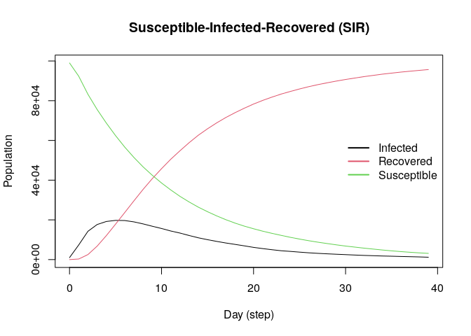
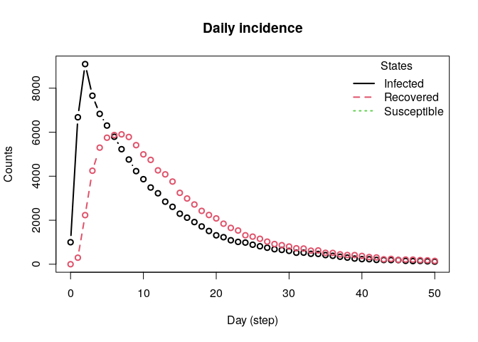
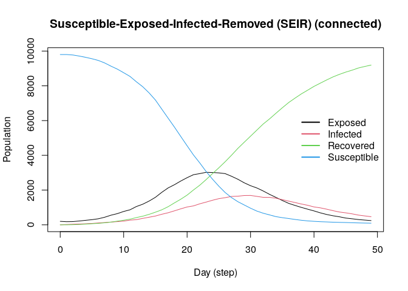
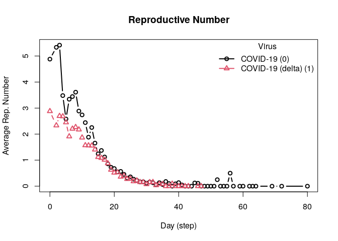
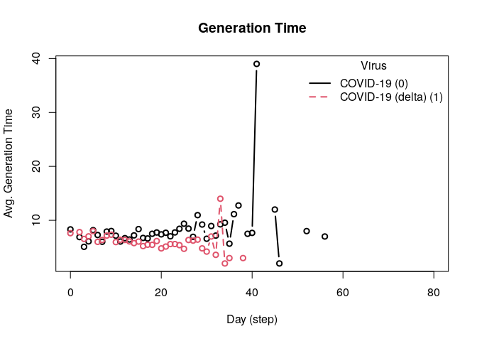
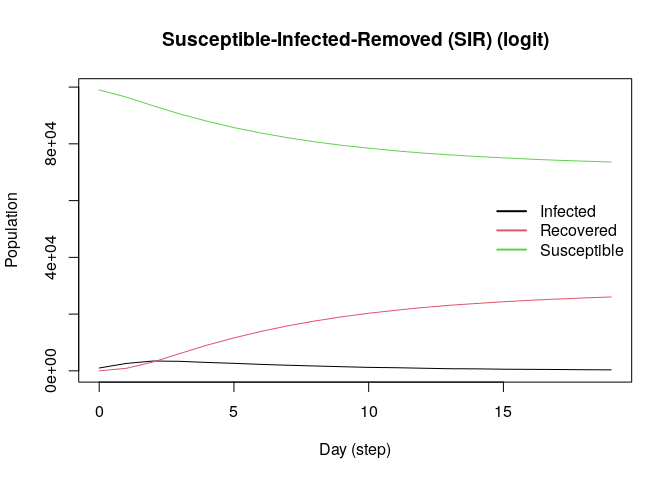
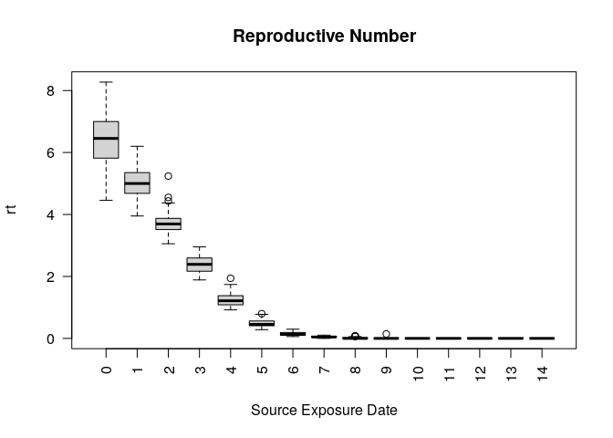

<!-- README.md is generated from README.qmd. Please edit that file -->

# epiworldR

<!-- badges: start -->

[](https://CRAN.R-project.org/package=epiworldR)
[](https://github.com/UofUEpiBio/epiworldR/actions/workflows/r.yml)
[](https://cran.r-project.org/package=epiworldR)
[](https://github.com/UofUEpiBio/epiworldR/blob/master/LICENSE.md)
[](https://app.codecov.io/gh/UofUEpiBio/epiworldR)
[](https://github.com/EpiForeSITE)
<!-- badges: end -->

This R package is a wrapper of the C++ library
<a href="https://github.com/UofUEpiBio/epiworld"
target="_blank">epiworld</a>. It provides a general framework for
modeling disease transmission using <a
href="https://en.wikipedia.org/w/index.php?title=Agent-based_model&amp;oldid=1153634802"
target="_blank">agent-based models</a>. Some of the main features
include:

- Fast simulation with an average of 30 million agents/day per second.
- One model can include multiple diseases.
- Policies (tools) can be multiple and user-defined.
- Transmission can be a function of agents’ features.
- Out-of-the-box parallelization for multiple simulations.

From the package’s description:

> A flexible framework for Agent-Based Models (ABM), the epiworldR
> package provides methods for prototyping disease outbreaks and
> transmission models using a C++ backend, making it very fast. It
> supports multiple epidemiological models, including the
> Susceptible-Infected-Susceptible (SIS), Susceptible-Infected-Removed
> (SIR), Susceptible-Exposed-Infected-Removed (SEIR), and others,
> involving arbitrary mitigation policies and multiple-disease models.
> Users can specify infectiousness/susceptibility rates as a function of
> agents’ features, providing great complexity for the model dynamics.
> Furthermore, epiworldR is ideal for simulation studies featuring large
> populations.

Current available models:

1.  `ModelDiagram`
2.  `ModelDiffNet`
3.  `ModelMeaslesMixing`
4.  `ModelMeaslesMixingRiskQuarantine`
5.  `ModelMeaslesSchool`
6.  `ModelSEIR`
7.  `ModelSEIRCONN`
8.  `ModelSEIRD`
9.  `ModelSEIRDCONN`
10. `ModelSEIRMixing`
11. `ModelSEIRMixingQuarantine`
12. `ModelSIR`
13. `ModelSIRCONN`
14. `ModelSIRD`
15. `ModelSIRDCONN`
16. `ModelSIRLogit`
17. `ModelSIRMixing`
18. `ModelSIS`
19. `ModelSISD`
20. `ModelSURV`

## Installation

You can install the development version of epiworldR from
[GitHub](https://github.com/) with:

``` r
devtools::install_github("UofUEpiBio/epiworldR")
```

Or from <a href="https://uofuepibio.r-universe.dev/"
target="_blank">R-universe</a> (recommended for the latest development
version):

``` r
install.packages(
  'epiworldR',
  repos = c(
    'https://uofuepibio.r-universe.dev',
    'https://cloud.r-project.org'
  )
)
```

Or from CRAN

``` r
install.packages("epiworldR")
```

# Examples

This R package includes several popular epidemiological models,
including <a
href="https://en.wikipedia.org/w/index.php?title=Compartmental_models_in_epidemiology&amp;oldid=1155757336#Variations_on_the_basic_SIR_model"
target="_blank">SIS</a>, <a
href="https://en.wikipedia.org/w/index.php?title=Compartmental_models_in_epidemiology&amp;oldid=1155757336#The_SIR_model"
target="_blank">SIR</a>, and <a
href="https://en.wikipedia.org/w/index.php?title=Compartmental_models_in_epidemiology&amp;oldid=1155757336#The_SEIR_model"
target="_blank">SEIR</a> using either a fully connected graph (similar
to a compartmental model) or a user-defined network.

## SIR model using a random graph

This Susceptible-Infected-Recovered model features a population of
100,000 agents simulated in a small-world network. Each agent is
connected to ten other agents. One percent of the population has the
virus, with a 70% chance of transmission. Infected individuals recover
at a 0.3 rate:

``` r
library(epiworldR)
#> Thank you for using epiworldR! Please consider citing it in your work.
#> You can find the citation information by running
#>   citation("epiworldR")

# Creating a SIR model
sir <- ModelSIR(
  name              = "COVID-19",
  prevalence        = .01,
  transmission_rate = .7,
  recovery          = .3
) |>
  # Adding a Small world population
  agents_smallworld(n = 100000, k = 10, d = FALSE, p = .01) |>
  # Running the model for 50 days
  run(ndays = 50, seed = 1912)
#> _________________________________________________________________________
#> |Running the model...
#> |||||||||||||||||||||||||||||||||||||||||||||||||||||||||||||||||||||||||

sir
#> ________________________________________________________________________________
#> Susceptible-Infected-Recovered (SIR)
#> It features 100000 agents, 1 virus(es), and 0 tool(s).
#> The model has 3 states.
#> The final distribution is: 0 Susceptible, 0 Infected, and 100000 Recovered.
```

Visualizing the outputs

``` r
summary(sir)
#> ________________________________________________________________________________
#> ________________________________________________________________________________
#> SIMULATION STUDY
#>
#> Name of the model   : Susceptible-Infected-Recovered (SIR)
#> Population size     : 100000
#> Agents' data        : (none)
#> Number of entities  : 0
#> Days (duration)     : 50 (of 50)
#> Number of viruses   : 1
#> Last run elapsed t  : 59.00ms
#> Last run speed      : 84.55 million agents x day / second
#> Rewiring            : off
#>
#> Global events:
#>  (none)
#>
#> Virus(es):
#>  - COVID-19
#>
#> Tool(s):
#>  (none)
#>
#> Model parameters:
#>  - Recovery rate     : 0.3000
#>  - Transmission rate : 0.7000
#>
#> Distribution of the population at time 50:
#>   - (0) Susceptible :  99000 -> 0
#>   - (1) Infected    :   1000 -> 0
#>   - (2) Recovered   :      0 -> 100000
#>
#> Transition Probabilities:
#>  - Susceptible  0.85  0.15     -
#>  - Infected        -  0.70  0.30
#>  - Recovered       -     -  1.00
plot(sir)
```



``` r
plot_incidence(sir)
```



## SEIR model with a fully connected graph

The SEIR model is similar to the SIR model but includes an exposed
state. Here, we simulate a population of 10,000 agents with a 0.01
prevalence, a 0.6 transmission rate, a 0.5 recovery rate, and 7
days-incubation period. The population is fully connected, meaning
agents can transmit the disease to any other agent:

``` r
model_seirconn <- ModelSEIRCONN(
  name                = "COVID-19",
  prevalence          = 0.01,
  n                   = 10000,
  contact_rate        = 10,
  incubation_days     = 7,
  transmission_rate   = 0.1,
  recovery_rate       = 1 / 7
) |> add_virus(
  virus(
    name = "COVID-19 (delta)",
    prevalence = 0.01,
    as_proportion = TRUE,
    prob_infecting = 0.2,
    recovery_rate = 0.6,
    prob_death = 0.5,
    incubation = 7
))

set.seed(132)
run(model_seirconn, ndays = 100)
#> _________________________________________________________________________
#> Running the model...
#> |||||||||||||||||||||||||||||||||||||||||||||||||||||||||||||||||||||||||
summary(model_seirconn)
#> ________________________________________________________________________________
#> ________________________________________________________________________________
#> SIMULATION STUDY
#>
#> Name of the model   : Susceptible-Exposed-Infected-Removed (SEIR) (connected)
#> Population size     : 10000
#> Agents' data        : (none)
#> Number of entities  : 0
#> Days (duration)     : 100 (of 100)
#> Number of viruses   : 2
#> Last run elapsed t  : 17.00ms
#> Last run speed      : 56.11 million agents x day / second
#> Rewiring            : off
#>
#> Global events:
#>  - Update infected individuals (runs daily)
#>
#> Virus(es):
#>  - COVID-19
#>  - COVID-19 (delta)
#>
#> Tool(s):
#>  (none)
#>
#> Model parameters:
#>  - Avg. Incubation days : 7.0000
#>  - Contact rate         : 10.0000
#>  - Prob. Recovery       : 0.1429
#>  - Prob. Transmission   : 0.1000
#>
#> Distribution of the population at time 100:
#>   - (0) Susceptible :  9800 -> 59
#>   - (1) Exposed     :   200 -> 0
#>   - (2) Infected    :     0 -> 0
#>   - (3) Recovered   :     0 -> 9941
#>
#> Transition Probabilities:
#>  - Susceptible  0.95  0.05     -     -
#>  - Exposed         -  0.86  0.14     -
#>  - Infected        -     -  0.79  0.21
#>  - Recovered       -     -     -  1.00
```

Computing some key statistics

``` r
plot(model_seirconn)
```



``` r

repnum <- get_reproductive_number(model_seirconn)

head(plot(repnum))
```



    #>   virus_id    virus date      avg   n       sd lb    ub
    #> 1        0 COVID-19    0 4.880000 100 4.159157  0 14.05
    #> 2        0 COVID-19    2 5.333333   9 4.415880  1 12.60
    #> 3        0 COVID-19    3 5.416667  12 3.369875  1 10.45
    #> 4        0 COVID-19    4 3.480000  25 2.740438  0  9.80
    #> 5        0 COVID-19    5 2.580645  31 2.790152  0  9.00
    #> 6        0 COVID-19    6 3.339623  53 3.031523  0 10.40

    head(plot_generation_time(model_seirconn))



    #>   date      avg  n       sd ci_lower ci_upper    virus virus_id
    #> 1    0 8.318681 91 5.599363     2.00   20.500 COVID-19        0
    #> 2    2 6.888889  9 4.648775     2.20   14.000 COVID-19        0
    #> 3    3 5.083333 12 2.503028     3.00    9.725 COVID-19        0
    #> 4    4 6.095238 21 3.096849     2.00   12.500 COVID-19        0
    #> 5    5 8.173913 23 6.846712     2.55   24.000 COVID-19        0
    #> 6    6 7.272727 44 5.332496     2.00   19.000 COVID-19        0

## SIR Logit

This model provides a more complex transmission and recovery pattern
based on agents’ features. With it, we can reflect co-morbidities that
could change the probability of infection and recovery. Here, we
simulate a population including a dataset with two features: an
intercept and a binary variable `Female`. The probability of infection
and recovery are functions of the intercept and the `Female` variables.
The following code simulates a population of 100,000 agents in a
small-world network. Each agent is connected to eight other agents. One
percent of the population has the virus, with an 80% chance of
transmission. Infected individuals recover at a 0.3 rate:

``` r
# Simulating a population of 100,000 agents
set.seed(2223)
n <- 100000

# Agents' features
X <- cbind(
  Intercept = 1,
  Female    = sample.int(2, n, replace = TRUE) - 1
)

coef_infect  <- c(.1, -2, 2)
coef_recover <- rnorm(2)

# Creating the model
model_logit <- ModelSIRLogit(
  "covid2",
  data = X,
  coefs_infect      = coef_infect,
  coefs_recover     = coef_recover,
  coef_infect_cols  = 1L:ncol(X),
  coef_recover_cols = 1L:ncol(X),
  prob_infection = .8,
  recovery_rate = .3,
  prevalence = .01
)

# Adding a small-world population
agents_smallworld(model_logit, n, 8, FALSE, .01)

# Running the model
run(model_logit, 50)
#> _________________________________________________________________________
#> |Running the model...
#> |||||||||||||||||||||||||||||||||||||||||||||||||||||||||||||||||||||||||
plot(model_logit)
```



``` r

# Females are supposed to be more likely to become infected
rn <- get_reproductive_number(model_logit)

(table(
  X[, "Female"],
  (1:n %in% rn$source)
) |> prop.table())[, 2]
#>       0       1
#> 0.20717 0.22397

# Looking into the agents
get_agents(model_logit)
#> Agents from the model "Susceptible-Infected-Removed (SIR) (logit)":
#> Agent: 0, state: Susceptible (0), Has virus: no, NTools: 0i NNeigh: 8
#> Agent: 1, state: Susceptible (0), Has virus: no, NTools: 0i NNeigh: 8
#> Agent: 2, state: Susceptible (0), Has virus: no, NTools: 0i NNeigh: 8
#> Agent: 3, state: Susceptible (0), Has virus: no, NTools: 0i NNeigh: 8
#> Agent: 4, state: Susceptible (0), Has virus: no, NTools: 0i NNeigh: 8
#> Agent: 5, state: Susceptible (0), Has virus: no, NTools: 0i NNeigh: 8
#> Agent: 6, state: Susceptible (0), Has virus: no, NTools: 0i NNeigh: 8
#> Agent: 7, state: Susceptible (0), Has virus: no, NTools: 0i NNeigh: 8
#> Agent: 8, state: Susceptible (0), Has virus: no, NTools: 0i NNeigh: 8
#> Agent: 9, state: Susceptible (0), Has virus: no, NTools: 0i NNeigh: 8
#> ... 99990 more agents ...
```

## Transmission network

This example shows how we can draw a transmission network from a
simulation. The following code simulates a population of 500 agents in a
small-world network. Each agent is connected to ten other agents. One
percent of the population has the virus, with a 50% chance of
transmission. Infected individuals recover at a 0.5 rate:

``` r
# Creating a SIR model
sir <- ModelSIR(
  name           = "COVID-19",
  prevalence     = .01,
  transmission_rate = .5,
  recovery       = .5
) |>
  # Adding a Small world population
  agents_smallworld(n = 500, k = 10, d = FALSE, p = .01) |>
  # Running the model for 50 days
  run(ndays = 50, seed = 1912)
#> _________________________________________________________________________
#> |Running the model...
#> |||||||||||||||||||||||||||||||||||||||||||||||||||||||||||||||||||||||||

# Transmission network
net <- get_transmissions(sir)
net <- subset(net, source >= 0)

# Plotting
library(epiworldR)
library(netplot)
#> Loading required package: grid
x <- igraph::graph_from_edgelist(
  as.matrix(net[, 2:3]) + 1
)

nplot(x, edge.curvature = 0, edge.color = "gray", skip.vertex = TRUE)
```


## Multiple simulations

`epiworldR` supports running multiple simulations using the
`run_multiple` function. The following code simulates 50 SIR models with
1000 agents each. Each agent is connected to ten other agents. One
percent of the population has the virus, with a 90% chance of
transmission. Infected individuals recover at a 0.1 rate. The results
are saved in a `data.frame`:

``` r
model_sir <- ModelSIRCONN(
  name = "COVID-19",
  prevalence = 0.01,
  n = 1000,
  contact_rate = 2,
  transmission_rate = 0.9, recovery_rate = 0.1
)

# Generating a saver
saver <- make_saver("total_hist", "reproductive")

# Running and printing
# Notice the use of nthread = 2 to run the simulations in parallel
run_multiple(model_sir, ndays = 100, nsims = 50, saver = saver, nthread = 2)
#> Starting multiple runs (50) using 2 thread(s)
#> _________________________________________________________________________
#> _________________________________________________________________________
#> ||||||||||||||||||||||||||||||||||||||||||||||||||||||||||||||||||||||||| done.

# Retrieving the results
ans <- run_multiple_get_results(model_sir)

head(ans$total_hist)
#>   sim_num date nviruses       state counts
#> 1       1    0        1 Susceptible    990
#> 2       1    0        1    Infected     10
#> 3       1    0        1   Recovered      0
#> 4       1    1        1 Susceptible    973
#> 5       1    1        1    Infected     27
#> 6       1    1        1   Recovered      0
head(ans$reproductive)
#>   sim_num virus_id    virus source source_exposure_date rt
#> 1       1        0 COVID-19    683                    9  0
#> 2       1        0 COVID-19    983                    8  0
#> 3       1        0 COVID-19    875                    8  0
#> 4       1        0 COVID-19    801                    8  0
#> 5       1        0 COVID-19    770                    8  0
#> 6       1        0 COVID-19    758                    8  0

plot(ans$reproductive)
```



# Tutorials

- The virtual INSNA Sunbelt 2023 session can be found here:
  https://github.com/UofUEpiBio/epiworldR-workshop/tree/sunbelt2023-virtual

- The in-person INSNA Sunbelt 2023 session can be found here:
  https://github.com/UofUEpiBio/epiworldR-workshop/tree/sunbetl2023-inperson

# Citation

If you use `epiworldR` in your research, please cite it as follows:

``` r
citation("epiworldR")
#> To cite epiworldR in publications use:
#>
#>   Meyer, Derek and Vega Yon, George (2023). epiworldR: Fast Agent-Based
#>   Epi Models. Journal of Open Source Software, 8(90), 5781,
#>   https://doi.org/10.21105/joss.05781
#>
#> And the actual R package:
#>
#>   Meyer D, Pulsipher A, Vega Yon G (2025). _epiworldR: Fast Agent-Based
#>   Epi Models_. R package version 0.10.0.0,
#>   <https://github.com/UofUEpiBio/epiworldR>.
#>
#> To see these entries in BibTeX format, use 'print(<citation>,
#> bibtex=TRUE)', 'toBibtex(.)', or set
#> 'options(citation.bibtex.max=999)'.
```

# Existing Alternatives

Several alternatives to `epiworldR` exist and provide researchers with a
range of options, each with its own unique features and strengths,
enabling the exploration and analysis of infectious disease dynamics
through agent-based modeling. Below is a manually curated table of
existing alternatives, including ABM \[@ABM\], abmR \[@abmR\], cystiSim
\[@cystiSim\], villager \[@villager\], and RNetLogo \[@RNetLogo\].

| Package | Multiple Viruses | Multiple Tools | Multiple Runs | Global Actions | Built-In Epi Models | Dependencies | Activity |
|:---|:---|:---|:---|:---|----|:---|:---|
| [**epiworldR**](https://cran.r-project.org/package=epiworldR) | yes | yes | yes | yes | yes | [](https://CRAN.R-project.org/package=epiworldR) | [](https://github.com/UofUEpiBio/epiworldR) |
| [**ABM**](https://cran.r-project.org/package=ABM) | \- | \- | \- | yes | yes | [](https://CRAN.R-project.org/package=ABM) | [](https://github.com/junlingm/ABM) |
| [**abmR**](https://cran.r-project.org/package=abmR) | \- | \- | yes | \- | \- | [](https://CRAN.R-project.org/package=abmR) | [](https://github.com/bgoch5/abmR) |
| [**cystiSim**](https://cran.r-project.org/package=cystiSim) | \- | yes | yes | \- | \- | [](https://CRAN.R-project.org/package=cystiSim) | [](https://github.com/brechtdv/cystiSim) |
| [**villager**](https://cran.r-project.org/package=villager) | \- | \- | \- | yes | \- | [](https://CRAN.R-project.org/package=villager) | [](https://github.com/zizroc/villager) |
| [**RNetLogo**](https://cran.r-project.org/package=RNetLogo) | \- | yes | yes | yes | \- | [](https://CRAN.R-project.org/package=RNetLogo) | [](https://github.com/cran/RNetLogo) |

# Other ABM R packages

You may want to check out other R packages for agent-based modeling:
<a href="https://cran.r-project.org/package=ABM"
target="_blank"><code>ABM</code></a>,
<a href="https://cran.r-project.org/package=abmR"
target="_blank"><code>abmR</code></a>,
<a href="https://cran.r-project.org/package=cystiSim"
target="_blank"><code>cystiSim</code></a>,
<a href="https://cran.r-project.org/package=villager"
target="_blank"><code>villager</code></a>, and
<a href="https://cran.r-project.org/package=RNetLogo"
target="_blank"><code>RNetLogo</code></a>.

# Contributing to epiworldR

We welcome contributions to the epiworldR package! If you would like to
contribute, please review our [development
guidelines](https://github.com/UofUEpiBio/epiworldR/blob/main/DEVELOPMENT.md)
before creating a pull request.

## Code of Conduct

The epiworldR project is released with a [Contributor Code of
Conduct](https://contributor-covenant.org/version/2/1/CODE_OF_CONDUCT.html).
By contributing to this project, you agree to abide by its terms.
