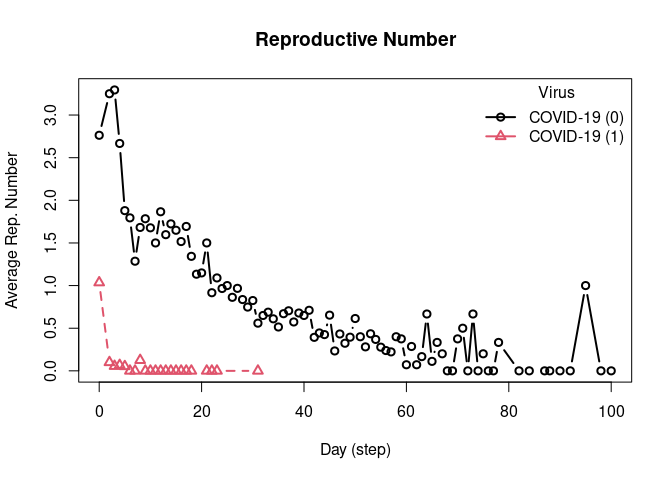

<!-- README.md is generated from README.Rmd. Please edit that file -->

[](https://github.com/UofUEpi/epiworldR/actions/workflows/r.yml)

# epiworldR

<!-- badges: start -->
<!-- badges: end -->

This R package is a wrapper of the C++ library
[epiworld](https://github.com/UofUEpi/epiworld). It provides a general
framework for modeling disease transmission using Agent-Based Models.
Some of the main features include:

- Fast simulation with an average of 30 million agents/day per second.
- One model can include multiple diseases.
- Policies (tools) can be multiple and user-defined.

## Installation

You can install the development version of epiworldR from
[GitHub](https://github.com/) with:

``` r
# install.packages("devtools")
devtools::install_github("UofUEpi/epiworldR")
```

# Examples

This R package comes shipped with a handful of popular epidemiological
models, including SIS, SIR, and SEIR using either a fully connected
graph (similar to a compartmental model) or a user-defined network. Here
are some examples:

## SIR model using a random graph

This Susceptible-Infected-Recovered model features a population of
100,000 agents simulated in a small-world network. Each agent is
connected to ten other agents. One percent of the population has the
virus, which can be transmitted with a 70% chance. Infected individuals
recover at a 0.3 rate:

``` r
library(epiworldR)

# Creating a SIR model
sir <- ModelSIR(
  name           = "COVID-19",
  prevalence     = .01,
  infectiousness = .7,
  recovery       = .3
  ) |>
  # Adding a Small world population 
  agents_smallworld(n = 100000, k = 10, d = FALSE, p = .01) |>
  # Running the model for 50 days
  run(ndays = 50, seed = 1912)
#> _________________________________________________________________________
#> |Running the model...
#> |||||||||||||||||||||||||||||||||||||||||||||||||||||||||||||||||||||||| done.
#> | done.

sir
#> 
#> ________________________________________________________________________________
#> SIMULATION STUDY
#> 
#> Name of the model   : Susceptible-Infected-Recovered (SIR)
#> Population size     : 100000
#> Number of entities  : 0
#> Days (duration)     : 50 (of 50)
#> Number of variants  : 1
#> Last run elapsed t  : 186.00ms
#> Last run speed      : 26.75 million agents x day / second
#> Rewiring            : off
#> 
#> Virus(es):
#>  - COVID-19 (baseline prevalence: 1.00%)
#> 
#> Tool(s):
#>  (none)
#> 
#> Model parameters:
#>  - Infectiousness    : 0.7000
#>  - Prob. of Recovery : 0.3000
#> 
#> Distribution of the population at time 50:
#>  - (0) Susceptible :  99000 -> 822
#>  - (1) Infected    :   1000 -> 415
#>  - (2) Recovered   :      0 -> 98763
#> 
#> Transition Probabilities:
#>  - Susceptible  0.91  0.09  0.00
#>  - Infected     0.00  0.70  0.30
#>  - Recovered    0.00  0.00  1.00
```

Visualizing the outputs

``` r
plot(sir)
```


## SEIR Model with a fully connected graph

``` r
model_seirconn <- ModelSEIRCONN(
  name                = "COVID-19",
  prevalence          = 0.01, 
  n                   = 10000,
  contact_rate        = 4, 
  incubation_days     = 7, 
  prob_transmission   = 0.6,
  prob_recovery       = 0.5
)

set.seed(132)
run(model_seirconn, ndays = 100)
#> _________________________________________________________________________
#> Running the model...
#> ||||||||||||||||||||||||||||||||||||||||||||||||||||||||||||||||||||||||| done.
#>  done.
model_seirconn
#> 
#> ________________________________________________________________________________
#> SIMULATION STUDY
#> 
#> Name of the model   : Susceptible-Exposed-Infected-Removed (SEIR) (connected)
#> Population size     : 10000
#> Number of entities  : 0
#> Days (duration)     : 100 (of 100)
#> Number of variants  : 1
#> Last run elapsed t  : 37.00ms
#> Last run speed      : 26.55 million agents x day / second
#> Rewiring            : off
#> 
#> Virus(es):
#>  - COVID-19 (baseline prevalence: 1.00%)
#> 
#> Tool(s):
#>  (none)
#> 
#> Model parameters:
#>  - Avg. Incubation days : 7.0000
#>  - Contact rate         : 4.0000
#>  - Prob. Recovery       : 0.5000
#>  - Prob. Transmission   : 0.6000
#> 
#> Distribution of the population at time 100:
#>  - (0) Susceptible :  9900 -> 98
#>  - (1) Exposed     :   100 -> 0
#>  - (2) Infected    :     0 -> 0
#>  - (3) Recovered   :     0 -> 9902
#> 
#> Transition Probabilities:
#>  - Susceptible  0.96  0.04  0.00  0.00
#>  - Exposed      0.00  0.87  0.13  0.00
#>  - Infected     0.00  0.00  0.49  0.51
#>  - Recovered    0.00  0.00  0.00  1.00
```

Computing some key statistics

``` r
plot(model_seirconn)
```


``` r

repnum <- get_reproductive_number(model_seirconn)
plot(repnum, type = "b")
```



## SIR Logit

``` r

set.seed(2223)
n <- 100000

X <- cbind(
  Intercept = 1,
  Female    = sample.int(2, n, replace = TRUE) - 1
  )

coef_infect  <- c(.1, -2, 2)
coef_recover <- rnorm(2)

model_logit <- ModelSIRLogit(
  "covid2",
  data = X,
  coefs_infect      = coef_infect,
  coefs_recover     = coef_recover, 
  coef_infect_cols  = 1L:ncol(X),
  coef_recover_cols = 1L:ncol(X),
  prob_infection = .8,
  prob_recovery = .3,
  prevalence = .01
)

agents_smallworld(model_logit, n, 8, FALSE, .01)

run(model_logit, 50)
#> _________________________________________________________________________
#> |Running the model...
#> |||||||||||||||||||||||||||||||||||||||||||||||||||||||||||||||||||||||| done.
#> | done.

plot(model_logit)
```


``` r

# Females are supposed to be more likely to become infected
rn <- get_reproductive_number(model_logit)

(table(
  X[, "Female"],
  (1:n %in% rn$source)
) |> prop.table())[,2]
#>       0       1 
#> 0.12984 0.14201

# Looking into the agents
get_agents(model_logit)
#> Agents from the model "Susceptible-Infected-Removed (SIR) (logit)":
#> Agent: 0, state: Recovered (2), Nvirus: 0, NTools: 0, NNeigh: 8
#> Agent: 1, state: Recovered (2), Nvirus: 0, NTools: 0, NNeigh: 8
#> Agent: 2, state: Recovered (2), Nvirus: 0, NTools: 0, NNeigh: 8
#> Agent: 3, state: Recovered (2), Nvirus: 0, NTools: 0, NNeigh: 8
#> Agent: 4, state: Recovered (2), Nvirus: 0, NTools: 0, NNeigh: 8
#> Agent: 5, state: Recovered (2), Nvirus: 0, NTools: 0, NNeigh: 8
#> Agent: 6, state: Recovered (2), Nvirus: 0, NTools: 0, NNeigh: 8
#> Agent: 7, state: Recovered (2), Nvirus: 0, NTools: 0, NNeigh: 8
#> Agent: 8, state: Susceptible (0), Nvirus: 0, NTools: 0, NNeigh: 8
#> Agent: 9, state: Recovered (2), Nvirus: 0, NTools: 0, NNeigh: 8
#> ... 99990 more agents ...
```
