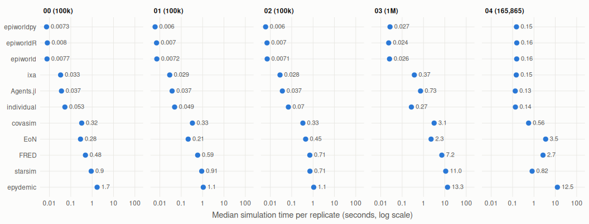
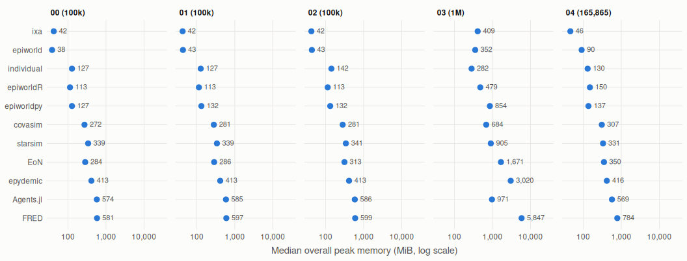

The [epiworld-benchmark](https://github.com/UofUEpiBio/epiworld-benchmark)
compares epiworldR, the C++ library that powers it, the Python wrapper, and
other epidemic agent-based-model engines. It runs common SEIRH models on common
contact networks and records simulation time and resident memory.

In the scenarios currently covered, the epiworld family is among the fastest.
Native epiworld is also among the lower-memory implementations; epiworldR
shares that simulation core while its overall process memory includes R's
runtime. The figures below summarize the current scenarios at their largest
population sizes.

*Median simulation time per replicate. Source: the benchmark
[overview](https://github.com/UofUEpiBio/epiworld-benchmark#summary).*

*Median overall peak resident memory. Source: the benchmark
[overview](https://github.com/UofUEpiBio/epiworld-benchmark#summary).*

## A work in progress

This benchmark is a snapshot of the versions, SEIRH workloads, and environment
tested so far; it is not a universal ranking. Other engines may perform
especially well for scenarios better aligned with their designs. The benchmark
is still adding engines and scenarios, and welcomes contributions, corrections,
and implementation improvements. See its
[methods](https://github.com/UofUEpiBio/epiworld-benchmark/blob/main/docs/methods.md),
[full results](https://github.com/UofUEpiBio/epiworld-benchmark/blob/main/docs/results.md),
[scenario guide](https://github.com/UofUEpiBio/epiworld-benchmark/blob/main/scenarios.md),
[issues](https://github.com/UofUEpiBio/epiworld-benchmark/issues), and
[pull requests](https://github.com/UofUEpiBio/epiworld-benchmark/pulls) for
the current scope and ways to participate.
